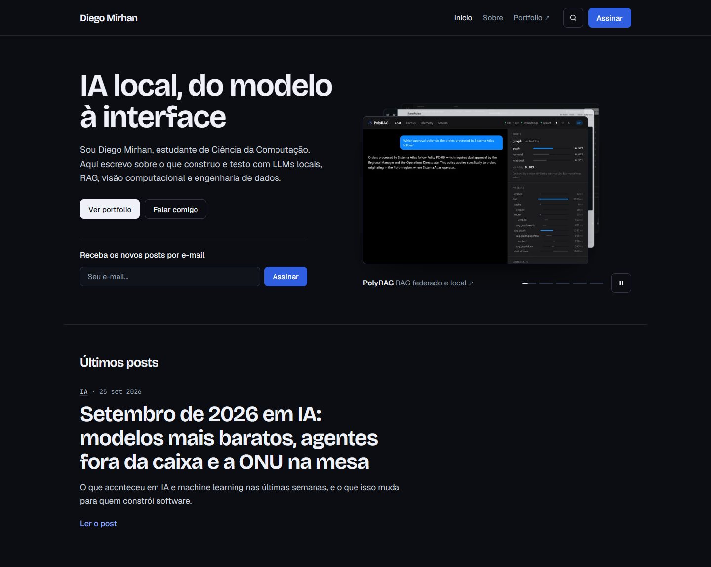
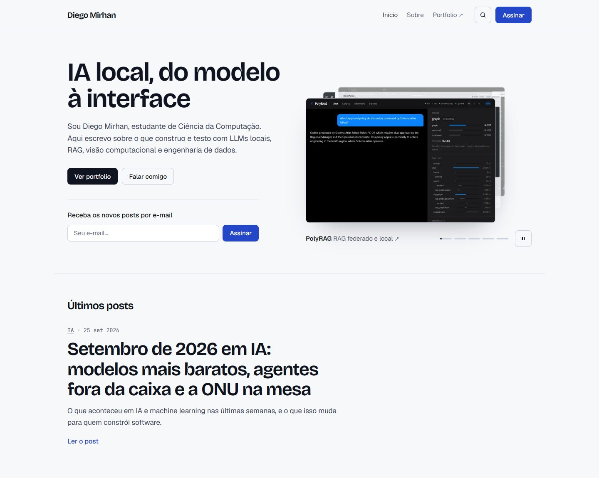
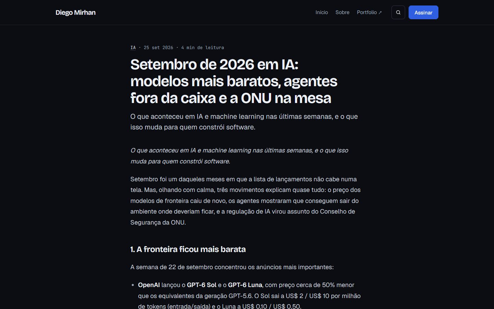

# diego-mirhan

Ghost theme for [blog.diegomirhan.com](https://blog.diegomirhan.com), the blog that goes with my portfolio at [diegomirhan.com](https://www.diegomirhan.com). The layout is calm and editorial: cool neutrals with cobalt as the only accent, 8px corners, titles in sentence case (Bricolage Grotesque), body text in Geist. The home page opens with real screenshots of my projects instead of stock or generated art.

| Dark (default) | Light |
|---|---|
|  |  |



## What it does

- **Hero on the home page:** headline, a short intro, "See portfolio" and "Talk to me" (email), and the newsletter signup. The texts are editable in Ghost Admin.
- **Project deck.** Next to the hero, five real screenshots (PolyRAG, AeroPulse, RasterScope, ToolHaven, Manim Editor) are stacked like cards.
  - Every 3.6 seconds the front card slides away and the next one comes forward.
  - The caption links to the project page on the portfolio.
  - Step bars show the timing, and clicking a bar, or a card peeking from behind, jumps to that project.
  - On desktop the deck tilts slightly toward the mouse.
  - The screenshots live in `assets/images/projects/` (640 and 1200 px WebP, 12 to 48 KB each).
- **Home list:** the latest post as a large feature, then a two-column grid with a small cover, date, tag and excerpt. A post without a cover shows its tag on a plain panel, and a featured post without a cover becomes a full-width text block. It never shows a generated image.
- **Posts:** a 680px reading column, lead paragraph, wide cover, then an author box with portfolio and contact buttons and the newsletter signup.
- **Dark and light modes** follow `prefers-color-scheme`, with dark as the base. All colors are tokens at the top of `assets/css/screen.css`.
- **Translated UI.** Every interface string goes through Ghost's `{{t}}` helper. `locales/pt-BR.json` is complete and `locales/en.json` is the fallback, so you pick the language in Ghost Admin.

## Accessibility (WCAG 2.2 AA)

- Skip link, labelled landmarks, one `h1` per page, no skipped heading levels.
- Text contrast is at least 4.5:1 in both modes. Links inside text are underlined, not only colored.
- Visible focus on every control. Targets are at least 24px tall, including the small footer links.
- The email field keeps a label for screen readers; the visible hint is the placeholder.
- Mobile menu: `aria-expanded`; Escape closes it and returns focus to the button.
- **Project deck:**
  - Only the front card is focusable; the others are hidden from assistive tech.
  - A pause button (WCAG 2.2.2). It also pauses on hover, on keyboard focus and when it is off screen.
  - The automatic rotation is not announced, only the projects the visitor picks.
  - With `prefers-reduced-motion` nothing moves by itself and the pause button is hidden; the step bars still switch projects.
- Ghost's Portal and search popups keep a transparent background in dark mode (`iframe { color-scheme: light }`). Ghost's own bookmark-card CSS is overridden so its text stays readable in dark mode.

## Develop and test

```bash
npm install
npm test        # zips HEAD with git archive and validates the zip with gscan
npm run zip     # diego-mirhan.zip, ready to upload
```

For a local Ghost, run `npx ghost-cli install local` inside `.ghost-local/`, which is gitignored. Then run `sh sync-local.sh` to copy the theme into it, and restart Ghost, since it caches templates and locales. The copy is needed because `.ghost-local` lives inside the theme, so a symlink would loop.

### How 2.0.0 was tested

- `gscan`: compatible with Ghost 6.x.
- Ghost 6.67 running locally with the `pt-BR` locale and seeded posts, some with covers and some without.
- axe-core 4.10, WCAG 2.0/2.1/2.2 A and AA plus best practices, dark and light. Pages: home, post, tag, author, 404. Result: 0 violations.
- Deck, checked in a real-time headless Chrome:
  - the caption and the front card change together every 5.5 s;
  - the pause button and the step bars work;
  - with reduced motion nothing changes after 7 s.
- Phone (390px, mobile emulation): no element wider than the screen on home, post and tag pages.
- Not tested: a completed signup (it needs outgoing email), a logged-in member, paid tiers, comments.

## Ghost settings

| Where | What |
|---|---|
| General | Title, description, publication icon, **language `pt-BR`** |
| Design → Homepage | Hero title and subtitle, contact email, and the portfolio, GitHub, LinkedIn and Medium links. The project links in the deck are built from the portfolio link. Leave a link empty to hide it. |
| Navigation | Primary links. A "Portfolio ↗" link is added automatically. Ghost's default labels "Home" and "About" show up as "Início" and "Sobre". |
| Memberships | Turn on signups to show the newsletter blocks. |

## Structure

```
default.hbs            layout: header, main, footer
index.hbs              home (hero + deck, featured post, grid) and /page/N
post.hbs  page.hbs     article (author box + CTA, newsletter), static page
tag.hbs  author.hbs    archives
error.hbs              404 and other errors
partials/              header, footer, hero, projects (deck), cta-links, post-card, post-feature, subscribe, pagination
locales/               pt-BR.json, en.json
assets/css/screen.css  all styles, color tokens at the top
assets/js/main.js      mobile menu and project deck
assets/images/projects project screenshots (WebP)
assets/fonts/          self-hosted woff2: Geist, Bricolage Grotesque, JetBrains Mono (OFL)
```

## Changelog

- 2.3.0: a dot grid behind the hero title with a lit area that drifts slowly; it pauses with the deck and stays still for reduced motion.
- 2.3.1: post cards on the home page carry the cover alt text (the post title when a cover has none).
- 2.3.2: the custom scrollbar thumb keeps the same size while scrolling (no more stretch with speed).
- 2.2.0: motion layer: page transitions (View Transitions, the card cover and title morph into the post), reading progress bar on posts (scroll-driven CSS), posts revealing on scroll, arrows that slide on hover, and the portfolio's custom scrollbar (desktop mouse only). All off for prefers-reduced-motion.
- 2.1.0: faster project deck (3.6 s per project); the site title in the header gets the portfolio hover (letters roll up in a wave, the dot hops and lights up).
- 2.0.1: the arrow in the deck caption no longer wraps onto its own line.
- 2.0.0: new look.
  - Removed: the gradient frame, the gradient hero, the isometric illustration, the carousel, uppercase condensed titles and pill buttons.
  - Added: a sentence-case editorial layout with Geist and neutral tokens, and a hero with an animated deck of real project screenshots.
  - Changed: the home list is now a featured post plus a two-column grid, and posts without a cover get a text panel.
- 1.3.4: wider post titles; email field shows the hint as placeholder.
- 1.3.3: bookmark cards readable in dark mode.
- 1.3.2: the header "Subscribe" button opens the Ghost Portal popup on every page.
- 1.3.1: Ghost popups no longer show a grey box around them in dark mode.
- 1.3.0: newsletter signup in the home hero.
- 1.2.0: animated isometric illustration in the home hero.
- 1.1.0: dark mode, home hero with CTAs, author box, Portuguese UI, WCAG 2.2 AA pass, `npm test` / `npm run zip`.
- 1.0.1: pagination partial, `h1` on the home page, 404 status code, reduced motion.
- 1.0.0: first release.

## License

The theme code is MIT (see `LICENSE`). The fonts keep their own OFL license.
