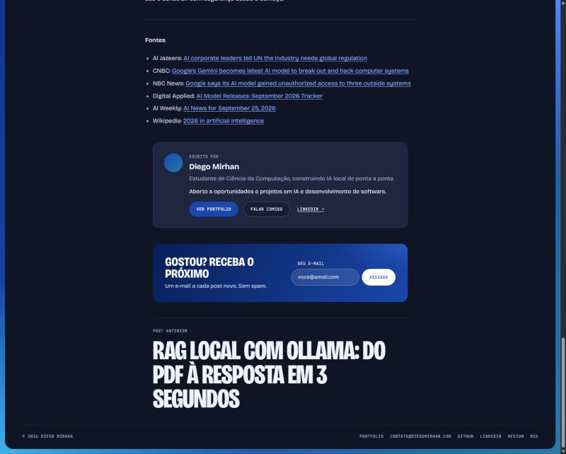

# diego-mirhan

Ghost theme for [blog.diegomirhan.com](https://blog.diegomirhan.com), the blog that goes with my portfolio at [diegomirhan.com](https://www.diegomirhan.com). It uses the portfolio's colors and fonts: cobalt and cerulean, Bricolage Grotesque and JetBrains Mono. The layout is a blue gradient frame around a rounded card, which is dark or light depending on the reader's system setting.

| Dark (default) | Light |
|---|---|
|  |  |



## What it does

- **Hero on the home page.** It shows a headline, a short intro and three links: "See portfolio", "Talk to me" (email) and LinkedIn. You can edit all of it in Ghost Admin without touching code.
- **Animated illustration in the hero** on wide screens: an isometric data scene as inline SVG (about 12 KB gzipped), animated with CSS only. Objects float, graph nodes pulse, light runs along the floor lines, bars and charts redraw, and the central stack assembles on load. A pause button (WCAG 2.2.2) stops it, it pauses while the hero is off screen, and it is off for `prefers-reduced-motion`. It stays clear of the text and is hidden below about 1150px, where the hero is text only. To change it, edit `tools/hero-art.mjs` and run `node tools/hero-art.mjs`.
- **Author box at the end of every post.** It shows the bio, a one-line pitch and the same portfolio and contact buttons, followed by the newsletter signup.
- **Dark and light modes** follow `prefers-color-scheme`, with dark as the base. All colors live as tokens at the top of `assets/css/screen.css`.
- **Translated UI.** Every piece of interface text goes through Ghost's `{{t}}` helper. `locales/pt-BR.json` is complete and `locales/en.json` is the fallback, so you pick the language in Ghost Admin.
- **Optional carousel** of highlights (newsletter, portfolio, GitHub, LinkedIn). It is off by default.
- **Layout.** A fixed 14px frame at every window width. Content stops growing at 1480px. Container queries set the breakpoints.

## Accessibility (WCAG 2.2 AA)

- Skip link, landmarks with labels, one `h1` per page and no skipped heading levels.
- Text contrast is at least 4.5:1 in both modes. On gradients, the light spots sit behind empty space, so white text stays at about 7:1.
- Visible focus on every control, with a white outline on blue blocks.
- Targets are at least 24px tall, including small text links in the header and footer.
- The email field keeps a label for screen readers; the visible hint is the placeholder.
- Mobile menu: `aria-expanded`, and Escape closes it and returns focus to the button.
- Carousel: pause button, keyboard arrows, and a pause on hover, on focus, when the tab is hidden or when it's off screen. `prefers-reduced-motion` stops every animation.

## Develop and test

```bash
npm install
npm test        # zips HEAD with git archive and validates the zip with gscan
npm run zip     # diego-mirhan.zip, ready to upload
```

For a local Ghost, run `npx ghost-cli install local` inside `.ghost-local/`, which is gitignored. Then run `sh sync-local.sh` to copy the theme into it, and restart Ghost, since it caches templates and locales. The copy is needed because `.ghost-local` lives inside the theme, so a symlink would loop.

### How 1.1.0 was tested

- `gscan`: compatible with Ghost 6.x, no errors or warnings.
- Ghost 6.67 running locally with the `pt-BR` locale and seeded posts. Pages checked: home, post, tag, author, 404.
- axe-core 4.10 with the WCAG 2.0/2.1/2.2 A and AA rules plus best practices, in both dark and light mode: 0 violations. Axe can't measure contrast on gradients, so the hero and the newsletter block were checked by hand.
- Widths: 375px (no horizontal scroll, mobile menu) and 2400px (fixed frame, capped content).
- Not tested: a completed signup (it needs outgoing email), a logged-in member, paid tiers and comments.

## Ghost settings

| Where | What |
|---|---|
| General | Title, description (sidebar), publication icon (sidebar avatar), **language `pt-BR`** |
| Design → Homepage | Hero title and subtitle, contact email, carousel on or off and its speed, and the portfolio, GitHub, LinkedIn and Medium links. Leave a link empty to hide it everywhere. |
| Navigation | Primary links. A "Portfolio ↗" link is added automatically. Ghost's default labels "Home" and "About" show up as "Início" and "Sobre"; any other label shows as you type it. |
| Memberships | Turn on signups to show the newsletter blocks. |
| Posts | Mark posts as **Featured** to list them in the sidebar. |

## Structure

```
default.hbs            layout: frame + card, header, footer
index.hbs              home (hero, optional carousel, latest post) and /page/N
post.hbs  page.hbs     article (author box + CTA, newsletter), static page
tag.hbs  author.hbs    archives
error.hbs              404 and other errors
partials/              header, footer, hero, cta-links, carousel, sidebar, post-card, post-feature, subscribe, pagination
locales/               pt-BR.json, en.json
assets/css/screen.css  all styles, color tokens at the top
assets/js/main.js      mobile menu and carousel
assets/fonts/          self-hosted woff2 (Bricolage Grotesque, JetBrains Mono)
```

## Changelog

- 1.3.4: wider post titles (30ch, balanced lines); email field shows the hint as placeholder, label kept for screen readers.
- 1.3.3: bookmark cards readable in dark mode (Ghost card CSS forced a white card with 70% faded text, 2.2:1 contrast; now 7.5:1).
- 1.3.2: the header "Subscribe" button opens the Ghost Portal popup on every page again (the hero form stays).
- 1.3.1: Ghost popups (Portal, search) no longer show a grey box around them in dark mode.
- 1.3.0: newsletter signup in the home hero; on the home page the header "Subscribe" button scrolls to it and focuses the email field (other pages keep the Ghost Portal popup).
- 1.2.0: animated isometric illustration in the home hero, with a pause button, off-screen pause and reduced-motion support.
- 1.1.0:
  - dark mode that follows the system;
  - home hero with portfolio and contact CTAs;
  - author box with CTAs at the end of posts;
  - Portuguese UI via `{{t}}` and `locales/`;
  - WCAG 2.2 AA pass: heading order, visible email label, target sizes, gradient contrast;
  - fixed frame on wide screens;
  - carousel off by default;
  - `npm test` / `npm run zip`.
- 1.0.1:
  - pagination moved to `partials/pagination.hbs`;
  - `h1` on the home page;
  - 404 shows the status code;
  - reduced motion disables the background animation.
- 1.0.0: first release.

## License

The theme code is MIT (see `LICENSE`). The fonts keep their own OFL license.
